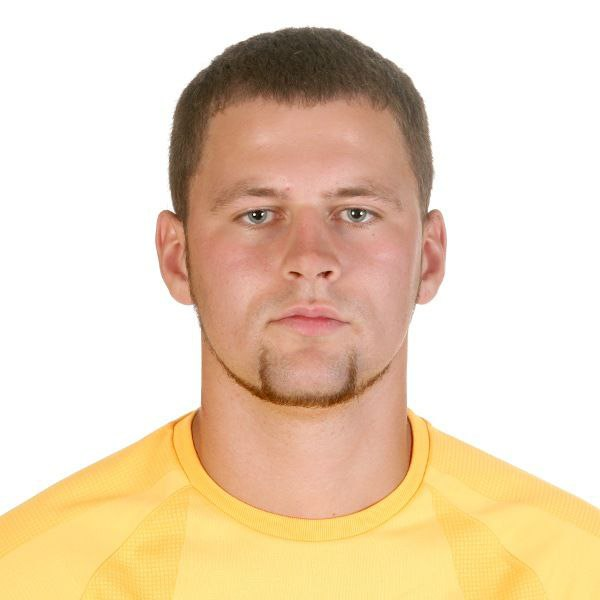

# Uladzislau Krus

## Frontend developer

## Tel +48576534125 diskord: Vlados91 telegram: @vladislavkrus

## I want to become a professional Frontend developer. I have always been interested in the IT field, but have never tried myself in this direction. I always achieve my goals. Now my main goal is to reach the end.

## My Skils: CSS, HTML, Avocode, Figma



```
describe("Multiply", () => {
it("fixed tests", () => {
assert.strictEqual(multiply(1,1), 1);
assert.strictEqual(multiply(2,1), 2);
assert.strictEqual(multiply(2,2), 4);
assert.strictEqual(multiply(3,5), 15);
 });
});
```

## work experience

## Now I study at RS School in the direction of [Frontend](https://rs.school/js-stage0/)

## Higher education, in the direction of Physical Education Coach

## Physical Education Coach Belarus Brest University.

## 2009-2014

## Landscape design courses

## 2015-2016

## A2 English level (pre-intermediate)
